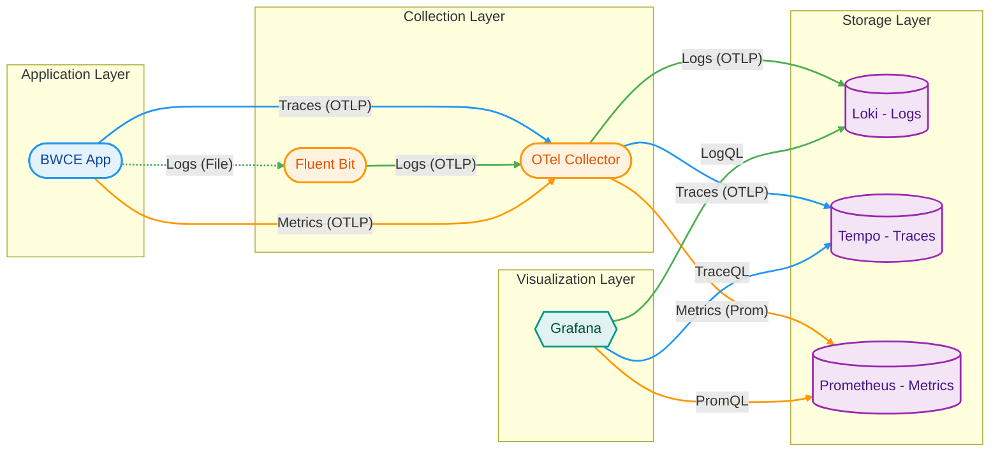
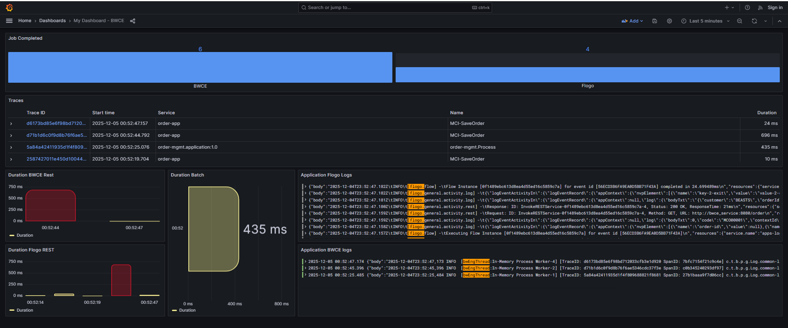

# BWCE Observability Stack: Logs & Traces Implementation

This document outlines the architecture, configuration, and Grafana dashboard setup for monitoring BWCE applications using Fluent Bit, OpenTelemetry Collector, Loki, Tempo, and Prometheus.


## 1. Prerequisites & Requirements

Before implementing this stack, ensure the following infrastructure and software versions are available.

**Software Versions**

- TIBCO BW6: Version 2.8.0 or higher (Required for native OpenTelemetry support)
- OpenTelemetry Collector: Contrib distribution (Required for the loki exporter; the core distribution does not include it).
- Fluent Bit: Version 1.9.0+ (Required for the opentelemetry output plugin).
- Grafana: Version 9.4+ (Recommended for full TraceQL support).
- Loki: Version 2.8+.
- Tempo: Version 2.0+.
- Prometheus: Version 2.45+ (For Metrics).

**Network & Ports**

Ensure the following ports are open within the Kubernetes cluster or host network:


- 4317 (TCP): OTLP gRPC receiver on OTel Collector (Used by BWCE and Fluent Bit).
- 4318 (TCP): OTLP HTTP receiver (Optional backup).
- 3100 (TCP): Loki HTTP API (Used by OTel Collector to push logs).
- 3200 (TCP): Tempo HTTP/gRPC (Used by OTel Collector to push traces).
- 9090 (TCP): Prometheus HTTP API (Used by Grafana).

**Configurations and files**

- License file to start BW6 application (if version >=6.12). In this repository is mounted from local folder (volume in app-service of docker-compose)
```yaml
volumes:
      - C:/Users/dmassimi/containers/resources/addons/license:/data/license:ro
```
- Dashboard sample in ./dashboards fodler

## 2. Architectural Overview

The following diagram illustrates the data flow from the application layer through collection and storage, ending at the visualization layer.





### Data Flow Logic

1. **Traces:** BWCE sends traces directly to the OTel Collector via OTLP (gRPC/HTTP).

2. **Logs:** BWCE writes logs to disk/stdout. Fluent Bit tails these files, converts them to OTLP, and forwards them to the OTel Collector.

3. **Metrics:** BWCE sends metrics via OTLP to the Collector, which exposes/pushes them to **Prometheus**.

4. **Routing:** The OTel Collector acts as a central router, sending Logs to **Loki**, Traces to **Tempo**, and Metrics to **Prometheus**.

5. **Visualization:** Grafana queries Loki (LogQL), Tempo (TraceQL), and Prometheus (PromQL).

## 2. Component Configuration

### A. BWCE Application (Traces)

*Enables the internal OpenTelemetry agent.*

Env var **`BW_JAVA_OPTS`**:

```yaml
environment:
      # Injecting the OTel configuration via BW_JAVA_OPTS
      - BW_JAVA_OPTS=
          -Dbw.engine.opentelemetry.enable=true
          -Dbw.engine.opentelemetry.metric.enable=true
          -Dbw.engine.opentelemetry.publish.phys.measurement=true
          -Dbw.engine.opentelemetry.span.exporter.endpoint=http://otel_collector:4317
          -Dbw.engine.opentelemetry.metric.exporter.endpoint=http://otel_collector:4317
          -Dbw.engine.opentelemetry.protocol=grpc
          -Dbw.engine.opentelemetry.resource.attributes=service.name=order-service-container
          -Dbw.frwk.event.subscriber.instrumentation.enabled=true
```

### B. Fluent Bit (Logs)

*Tails container logs and forwards them to OTel.*

**`fluent-bit.conf`**:

```ini
[INPUT]
    Name              tail
    Path              /var/log/containers/*.log
    Parser            docker
    Tag               kube.*

[OUTPUT]
    Name    opentelemetry
    Match   *
    Host    otel-collector
    Port    4317
    Logs_uri /v1/logs
```

### C. OpenTelemetry Collector

*Receives OTLP data and routes to backends.*

**`otel-config.yaml`**:

```yaml
receivers:
  otlp:
    protocols:
      grpc: { endpoint: "0.0.0.0:4317" }
      http: { endpoint: "0.0.0.0:4318" }

exporters:
  otlp: # To Tempo
    endpoint: "tempo:4317"
    tls: { insecure: true }
  loki: # To Loki
    endpoint: "http://loki:3100/loki/api/v1/push"
  prometheus: # To Prometheus (Scrape Target)
    endpoint: "0.0.0.0:8889"
    namespace: "bw_metrics"
    send_timestamps: true
    metric_expiration: 180m

service:
  pipelines:
    traces:
      receivers: [otlp]
      exporters: [otlp]
    logs:
      receivers: [otlp]
      exporters: [loki]
    metrics:
      receivers: [otlp]
      exporters: [prometheus]
```

## 3. Grafana Dashboard Setup

### Panel 1: Logs (Loki)

This panel filters logs for the specific Common Lib log package.

* **DataSource:** Loki

* **Query (LogQL):**

  ```logql
  {job="bwce-logs-via-otel-collector"} |= "c.t.b.p.g.Log.common-lib.Log"
  ```

* **Panel JSON Model:**

  ```json
  {
    "type": "logs",
    "title": "BWCE Common Lib Logs",
    "datasource": { "uid": "${LOKI_UID}" },
    "targets": [
      {
        "expr": "{job=\"bwce-logs-via-otel-collector\"} |= \"c.t.b.p.g.Log.common-lib.Log\"",
        "refId": "A"
      }
    ]
  }
  ```

### Panel 2: Traces (Tempo)

This panel lists traces matching the specific Order Management service and "Log" activity tag.

* **DataSource:** Tempo

* **Query (TraceQL):**

  ```traceql
  { resource.service.name = "order-mgmt.application:1.0" && span.ActivityName = "Log" }
  ```

* **Panel JSON Model:**

  ```json
  {
    "type": "table",
    "title": "Order Mgmt Traces",
    "datasource": { "uid": "${TEMPO_UID}" },
    "targets": [
      {
        "queryType": "traceql",
        "refId": "A",
        "expr": "{ resource.service.name = \"order-mgmt.application:1.0\" && span.ActivityName = \"Log\" }"
      }
    ]
  }
  ```
### Panel 3: Metrics (Prometheus)
This panel shows the total number of process instances created.

* **DataSource:** Prometheus

* **Query** (PromQL):

```promql
bw_metrics_COMPLETED_JOB_COUNT{AppName="order-mgmt.application"}
```

* **Panel JSON Model:**

```json
{
  "type": "stat",
  "title": "Total Job Count",
  "datasource": { "uid": "${PROMETHEUS_UID}" },
  "targets": [
    {
      "expr": "bw_metrics_COMPLETED_JOB_COUNT{AppName=\"order-mgmt.application\"}",
      "refId": "A",
      "legendFormat": "{{AppName}}"
    }
  ]
}

```

## 4. Linking Logs to Traces

To enable the "Split View" feature in Grafana (clicking a log to see the trace), configure the **Loki Data Source** settings:

1. Go to **Data Sources** > **Loki**.

2. Scroll to **Derived Fields**.

3. Add a new field:

   * **Name:** `TraceID`

   * **Regex:** `TraceID=(\w+)` (Adjust based on your actual log format)

   * **Query:** `${__value.raw}`

   * **Internal Link:** Enable this and select your **Tempo** datasource.

## 5. Docker Compose Operations

You can run all components using the following commands:

**Start the stack:**

```bash
docker compose up -d
```

**Stop the stack:**

```bash
docker compose down
```

## 6. Sample Dashboard

A sample dashboard is provided in the repository at `./dashboards/bwce-monitoring.json`.

**To import it:**

1. Open Grafana at [http://localhost:3000/dashboard/import](http://localhost:3000/dashboard/import).

2. Upload the JSON file or paste its content.

3. Select the appropriate Loki and Tempo data sources.



