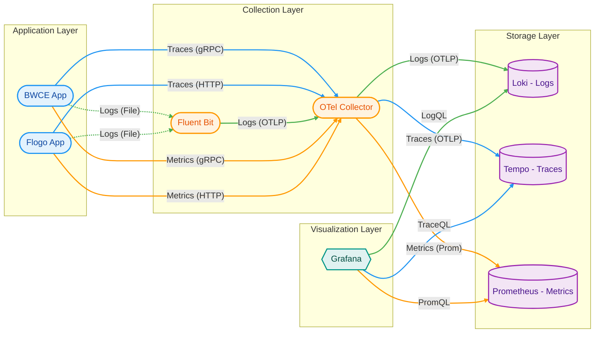

# BWCE/Flogo Observability Stack: Metrics, Logs & Traces Implementation

This document outlines the architecture, configuration, and Grafana dashboard setup for monitoring BWCE and Flogo applications using Fluent Bit, OpenTelemetry Collector, Loki, Tempo, and Prometheus.

## 1. Prerequisites & Requirements

Before implementing this stack, ensure the following infrastructure and software versions are available.

**Software Versions**

- TIBCO BW6: Version 2.8.0 or higher (Required for native OpenTelemetry support).
- TIBCO Flogo: Core version compatible with OTel (Standard Flogo Enterprise 2.15+ recommended).
- OpenTelemetry Collector: Contrib distribution (Required for the loki exporter; the core distribution does not include it).
- Fluent Bit: Version 1.9.0+ (Required for the opentelemetry output plugin).
- Grafana: Version 9.4+ (Recommended for full TraceQL support).
- Loki: Version 2.8+.
- Tempo: Version 2.0+.
- Prometheus: Version 2.45+ (For Metrics).

**Network & Ports**

Ensure the following ports are open within the Kubernetes cluster or host network:

- 4317 (TCP): OTLP gRPC receiver on OTel Collector (Used by BWCE and Fluent Bit).
- 4318 (TCP): OTLP HTTP receiver (Used by Flogo).
- 3100 (TCP): Loki HTTP API (Used by OTel Collector to push logs).
- 3200 (TCP): Tempo HTTP/gRPC (Used by OTel Collector to push traces).
- 9090 (TCP): Prometheus HTTP API (Used by Grafana).
- 8075 (TCP): Default Flogo App Port.

**Configurations and files**

- License file to start BW6 application (if version >=6.12). In this repository is mounted from local folder (volume in app-service of docker-compose):
```yaml
volumes:
      - C:/Users/dmassimi/containers/resources/addons/license:/data/license:ro
```
- Dashboard sample in `./dashboards` folder.

## 2. Architectural Overview

The following diagram illustrates the data flow from the application layer through collection and storage, ending at the visualization layer.



### Data Flow Logic

1. **Traces:** BWCE sends traces via **gRPC (4317)**. Flogo sends traces via **HTTP (4318)**. Both go to the OTel Collector.
2. **Logs:** Both apps write logs to disk/stdout. Fluent Bit tails these files, converts them to OTLP, and forwards them to the OTel Collector.
3. **Metrics:** Both apps send metrics via OTLP to the Collector, which exposes/pushes them to **Prometheus**.
4. **Routing:** The OTel Collector acts as a central router, sending Logs to **Loki**, Traces to **Tempo**, and Metrics to **Prometheus**.
5. **Visualization:** Grafana queries Loki (LogQL), Tempo (TraceQL), and Prometheus (PromQL).

## 2. Component Configuration

### A. BWCE Application

*Enables the internal OpenTelemetry agent.*

Env var **`BW_JAVA_OPTS`**:

```yaml
environment:
      # Injecting the OTel configuration via BW_JAVA_OPTS
      - BW_JAVA_OPTS=
          -Dbw.engine.opentelemetry.enable=true
          -Dbw.engine.opentelemetry.metric.enable=true
          -Dbw.engine.opentelemetry.publish.phys.measurement=true
          -Dbw.engine.opentelemetry.span.exporter.endpoint=http://otel_collector:4317
          -Dbw.engine.opentelemetry.metric.exporter.endpoint=http://otel_collector:4317
          -Dbw.engine.opentelemetry.protocol=grpc
          -Dbw.engine.opentelemetry.resource.attributes=service.name=order-service-container
          -Dbw.frwk.event.subscriber.instrumentation.enabled=true
```

### B. Flogo Application

*Enables OTel tracing via environment variables.*

```yaml
environment:
      - FLOGO_OTEL_TRACE_ENABLE=true
      - FLOGO_OTEL_TRACE_ENDPOINT=http://otel_collector:4318
      - FLOGO_OTEL_TRACE_SERVICE_NAME=flogo-order-service
```

### C. Fluent Bit (Logs)

*Tails container logs and forwards them to OTel.*

**`fluent-bit.conf`**:

```ini
[SERVICE]
    Flush         1
    Daemon        off
    Log_Level     info
    Parsers_File  parsers.conf
    
[INPUT]
    Name          tail
    Tag           docker.*
    # This path must match the mounted path in docker-compose.yaml
    Path          /var/lib/docker/containers/*/*-json.log
    DB            /var/log/flb_tail.db
    Parser        docker
    Mem_Buf_Limit 5MB
    Skip_Long_Lines On
    
# --- FILTER: Essential for Docker log parsing and making records structured ---
[FILTER]
    Name          parser
    Match         docker.*
    Key_Name      log
    Parser        json
    Reserve_Data  On

# --- OUTPUT: Send OTLP Logs to the OTEL Collector ---
[OUTPUT]
    Name          opentelemetry 
    Match         *
    Host          otel_collector     
    Port          4318             
    logs_uri      /v1/logs
    add_label     service.name apps-logs-via-otel-collector 
    
    Log_Response_Payload true
```

### D. OpenTelemetry Collector

*Receives OTLP data and routes to backends.*

**`otel-config.yaml`**:

```yaml
receivers:
  otlp:
    protocols:
      grpc: { endpoint: "0.0.0.0:4317" }
      http: { endpoint: "0.0.0.0:4318" } # Required for Flogo

exporters:
  otlp: # To Tempo
    endpoint: "tempo:4317"
    tls: { insecure: true }
  loki: # To Loki
    endpoint: "http://loki:3100/loki/api/v1/push"
  prometheus: # To Prometheus (Scrape Target)
    endpoint: "0.0.0.0:8889"
    namespace: "app_metrics" # Custom namespace
    send_timestamps: true
    metric_expiration: 180m

service:
  pipelines:
    traces:
      receivers: [otlp]
      exporters: [otlp]
    logs:
      receivers: [otlp]
      exporters: [loki]
    metrics:
      receivers: [otlp]
      exporters: [prometheus]
```

## 3. Grafana Dashboard Setup

### Panel 1: Logs (Loki)

This panel filters logs for the specific Common Lib log package.

* **DataSource:** Loki
* **Query (LogQL):**
  ```logql
  {job="bwce-logs-via-otel-collector"} |= "c.t.b.p.g.Log.common-lib.Log"
  ```

### Panel 2: Traces (Tempo)

This panel lists traces matching the specific Order Management service and "Log" activity tag.

* **DataSource:** Tempo
* **Query (TraceQL):**
  ```traceql
  { resource.service.name = "order-mgmt.application:1.0" && span.ActivityName = "Log" }
  ```

### Panel 3: Metrics (Prometheus)

This panel shows the total number of process instances created.

* **DataSource:** Prometheus
* **Query (PromQL):**
  ```promql
  app_metrics_COMPLETED_JOB_COUNT{AppName="order-mgmt.application"}
  ```

## 4. Docker Compose Operations
**IMPORTANT:** Before start docker compose you have to build Flogo and BW images. You will find in `./src` folder the source code for BW and Flogo and Dockerfile used to build them.

### Build Flogo Image
After built flogo application from VSCode, you have to put the application binary (in my case is `order`) into `./src/flogo/` and run the `docker build` command:

```bash
docker build . -t my-flogo-app:1.0.0 
```

### Build BW Image
For BW there are 2 steps to build image:

1) Build base image

To build base image go to your `TIBCO_HOME\bw\6.12\docker` and run `docker build` command:

```bash
docker build -t tibco/bwce:6.12 .
```

2) Build application Image

Once you have the base image you can build application image. Go to `./src/bw` folder and put there the ear you want to add to image (in my case is `order-mgmt.application-1.0.0-SNAPSHOT.ear`) run `docker build` command:

```bash
docker build . -t my-bw-app:6.12.0 
```


Now, you can run all components using the following commands:

**Start the stack:**
```bash
docker compose up -d
```

**Stop the stack:**
```bash
docker compose down
```

## 6. Sample Dashboard
Samples applications Flogo and BWCE are present in `./src` folder.
A sample dashboard is provided in the repository at `./dashboards/apps-dashboard.json`.

**To import it:**

1. Open Grafana at [http://localhost:3000/dashboard/import](http://localhost:3000/dashboard/import).

2. Upload the JSON file or paste its content.

3. Select the appropriate Loki and Tempo data sources.


